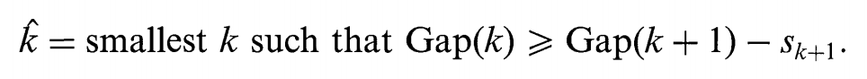

```{r setup, include=FALSE}
knitr::opts_chunk$set(echo = FALSE)
```

```{r,echo = FALSE, include=FALSE}
library(okcupiddata) # data
library(clustMixType) #for cluster wyith mixture data type  
library(dplyr) # for data cleaning
library(cluster) # for gower similarity and pam
library(Rtsne) # for t-SNE plot
library(ggplot2) # for visualization
library(downloader)
library(factoextra)
library(MASS)
library(fmsb)
library(knitr)
library(memisc)
library(fmsb)

data(profiles)
```
###In this project, we conduct extensive exploratory analysis using various visualization tools, clustering, and regression models on datasets obtained from Kaggle and OkCupid, one of the most widely used dating apps to derive meaningful insights into online dating. We hope to help everyone in the fray to increase their opportunity of finding the one. 

####First of all, we will explore the two data sets and get a general sense of the dating scene.

First, let's take a look at the distribution of height, which is converted into inches (1 foot = 12 inches). We can see the distribution is widely spreaded and some of them do not make sense in terms of heights. Therefore, we removed those rows that have extreme heights from our data.
```{r}
profiles_new <- profiles %>% na.omit()
# summary(profiles_new$height)
boxplot(profiles_new$height, main = 'Distribution of heights', ylab = 'Height in inches')
# Remove the "unreasonable" values (outliers)
outliers.h <- boxplot.stats(profiles_new$height)$out
profiles.sub1 <- filter(profiles_new, !height %in% outliers.h)

# Remove extreme and NA ages
profiles.sub2 <- filter(profiles.sub1, !is.na(age), !is.na(sex), age > 18, age < 80)
```

Let's start from some general information of the users.
### Sex and age distributions
```{r}
sex_dist <- ggplot(profiles.sub2, aes(x= sex, fill = sex)) + 
    geom_bar(position = "dodge", stat = "count")  +
    ggtitle("sex distribution") +
    ylab("count") + 
    xlab("age")
print(sex_dist)

sex.age <- group_by(profiles.sub2[, c("sex", "age")], sex, age) %>% summarize(n_age = n())

age_dist <- ggplot(sex.age, aes(x= age, y = n_age, color = sex)) + 
    geom_line(size = 1.5)  +
    ggtitle("age distribution by sex") +
    ylab("count") + 
    xlab("age") +
    theme(legend.position="right")
print(age_dist)
```

Surprisingly there are a lot more male using the dating app. Most of the users are in their mid-20s.

### Income difference by sex.
We also want to know the users' income information. 
```{r}
profiles.sub2$income %>% unique %>% sort

p1 <- ggplot(profiles.sub2, aes(x = sex)) +
  geom_bar(aes(y = ..count../sum(..count..), fill = as.factor(income))) + 
  theme(legend.position = "right") +
  ylab("Percent") + ggtitle("Income distribution by sex")
print(ggplotly(p1))
```

Womens’ incomes are lower than men’s. A larger percentage of women, for example, report an income of 20,000. Men also have a much higher representation incomes above 100,000.


### Religions difference
The religion data is a little complicated, as it includes both the affiliation and how serious they are about their belif. For simplicity, we will only focus on the affiliation attributes in this case.
```{r}
sample(unique(profiles.sub2$religion), 4)
profiles.sub3 <- profiles.sub2 %>% mutate(religious_affil = gsub(" [A-z ]*", "", religion))
profiles.sub3 <- profiles.sub3 %>% filter(religious_affil != "other")
p2 <- ggplot(profiles.sub3, aes(x = sex)) +
  geom_bar(aes(y = ..count../sum(..count..), fill = religious_affil)) + 
  theme(legend.position = "right") +
  ylab("Percent") + ggtitle("Religion distribution by sex")
print(ggplotly(p2))
```

A large proportion of men users reporting “atheism” and “agnosticism” as their affiliation, and women users have similar distribution with a slightly lower percentage.

### Drinking habit
```{r}
p3 <- ggplot(profiles.sub3, aes(x = sex)) +
  geom_bar(aes(y = ..count../sum(..count..), fill = drinks)) + 
  theme(legend.position = "right") +
  ylab("Percent") + ggtitle("Drinks distribution by sex")
print(ggplotly(p3))
```

More than half of the okcupid users are socially drinkers, and men users have a slightly greater tendency to drink “often” than women users.

### Speed Dating Data
We used the speed dating data to get a sense of the relationship between different attributes and number of matches.
```{r}
speed <- read.csv("~/Desktop/ADS/fall2017-project5-proj5-group6/data/speed-dating-experiment/Speed Dating Data.csv", na.strings = c("NA", ""), stringsAsFactors = F)
speed.sub <- speed %>% select(-id, -idg, -condtn, -round, -position, -positin1, -order, -partner, -undergra)
#change "income", "tuition" and "mn_sat" type as numerical
speed.sub$income  <- as.numeric(gsub(",", "", speed.sub$income))
speed.sub$tuition <- as.numeric(gsub(",", "", speed.sub$tuition))
speed.sub$mn_sat  <- as.numeric(gsub(",", "", speed.sub$mn_sat))
```

### Field and Career distribution by gender
```{r}
# Create study field codes
fields.cd <- c(
  "Law",
  "Math",
  "Social Science, Psychologist" ,
  "Medical Science, Pharmaceuticals, and Bio Tech",
  "Engineering",
  "English/Creative Writing/ Journalism",
  "History/Religion/Philosophy",
  "Business/Econ/Finance",
  "Education, Academia",
  "Biological Sciences/Chemistry/Physics",
  "Social Work" ,
  "Undergrad/undecided" ,
  "Political Science/International Affairs" ,
  "Film",
  "Fine Arts/Arts Administration",
  "Languages",
  "Architecture",
  "Other"
)

# Create career codes
career.cd <- c(
  "Lawyer",
  "Academic/Research", 
  "Psychologist", 
  "Doctor/Medicine",
  "Engineer", 
  "Creative Arts/Entertainment",
  "BankingBusiness/CEO/Admin",
  "Real Estate",
  "International/Humanitarian Affairs",
  "Undecided" ,
  "Social Work",
  "Speech Pathology",
  "Politics",
  "Pro sports/Athletics",
  "Other",
  "Journalism",
  "Architecture"
)

# Find number of men/women on each study field
fields <- speed.sub[!is.na(speed.sub$field_cd),] %>%
  group_by(gender, field_cd) %>%
  summarise(my.n = n())

# Find number of men/women on each career
careers <- speed.sub[!is.na(speed.sub$career_c),] %>%
  group_by(gender, career_c) %>%
  summarise(my.n = n())

# Plot study fields repartition
p4 <- ggplot(fields, aes(x = field_cd, y = my.n, fill = as.factor(gender))) +
  geom_bar(stat = "identity", position = "dodge") +
  scale_fill_discrete(name = "Gender") +
  xlab("Field") + ylab("Count") + ggtitle("Fields Distribution by sex") +
  scale_x_continuous(labels = fields.cd, breaks = 1:18) +
  coord_flip()
print(p4)

p5 <- ggplot(careers, aes(x = career_c, y = my.n, fill = as.factor(gender))) +
  geom_bar(stat = "identity", position = "dodge") +
  scale_fill_discrete(name = "Gender") +
  xlab("Career") + ylab("Count") + ggtitle("Careers Distribution by sex") +
  scale_x_continuous(labels = career.cd, breaks = 1:17) +
  coord_flip()
print(p5)
```

For OkCupid users, the majority proportion of the male users are major in Business/Finance field, and working in banking or other academic careers.


### Does age really matter? Relation between Age difference & no. of matches.
Here we draw the barplot of number of matches by number of years of age difference of the participants. Clearly, age does matter to most people! Most of the matches were made when the two participants have 0 to 3 years of age difference.
```{r}
# Group df by age and age_0
age.dist <- speed.sub %>%
  group_by(age, age_o) %>%
  summarise(n.people = n(), n.matches = sum(match)) %>%
  filter(!is.na(age) & !is.na(age_o))

# Filter with age difference > 5 years, and with more than 5 matches
age.diff <- age.dist %>%
  filter(age - age_o >= 0) %>%
  mutate(n.years = age - age_o) %>%
  group_by(n.years) %>%
  summarise(n.matches = sum(n.matches)) %>%
  arrange(n.years)

p6 <- ggplot(age.diff[age.diff$n.years < 20,], aes(x = n.years, y = n.matches)) +
  geom_bar(stat = "identity", position = "dodge") +
  xlab("Number of years of age difference") + 
  ylab("Number of matches") + 
  ggtitle("Distribution of Number of matches (by age difference)")
print(p6)
```


####Next, we explore the different categories within the online dating population with K-Means Clustering, so that people can identify themselves with a category and understand what kind of competition they are facing. 

####We performed K-Means on three of the continuous variables: age, height, and income, and did it on male and female respectively. 


```{r, echo=FALSE}
#head(profiles)
#summary(profiles)

# Data processing
profiles_new <- profiles %>% na.omit()
quant_profiles <- dplyr::select(profiles_new, age, height, income, sex)

quant_profiles_male0 <- filter(quant_profiles, sex =="m")
quant_profiles_male <- dplyr::select(quant_profiles_male0, age, height, income)

quant_profiles_female0 <- filter(quant_profiles, sex =="f")
quant_profiles_female <- dplyr::select(quant_profiles_female0, age, height, income)

## BEGIN Optimize the number of clusters
# How what value should the number of clusters take?
kmeans_wssplot <- function(input, num_clusters, seed=15, label){
  wss <- (nrow(input)-1)*sum(apply(input,2,var))
  for (i in 2:num_clusters){
    set.seed(seed)
    wss[i] <- sum(kmeans(input, centers=i)$withinss)}
  plot(1:num_clusters, wss, type="b", xlab=paste("Number of Clusters for", label),
       ylab="Within Groups Sum of Squares")
  text(1:num_clusters, wss,label=wss,col='blue')
}
```

###Optimize the Number of Clusters for K-Means

#### The plot trails off after 3, suggesting 3 or 4 might be a good choice for K.
```{r, echo=FALSE}
kmeans_wssplot(quant_profiles_male, num_clusters=6, label = "Male")
kmeans_wssplot(quant_profiles_female, num_clusters=6, label = "Female")
#
kmeans_wssplot2 <- function(input, num_clusters, seed=15, label){
  wss <- (nrow(input)-1)*sum(apply(input,2,var))
  for (i in 2:num_clusters){
    set.seed(seed)
    wss[i] <- sum(kmeans(input, centers=i)$withinss)}
  plot(2:num_clusters, wss[-1], type="b", xlab=paste("Number of Clusters for", label),
       ylab="Within Groups Sum of Squares")
  text(2:num_clusters, c(wss[-1]+1e11),label=wss,col='blue')
  }


kmeans_wssplot2(quant_profiles_male, num_clusters=8, label = "Male")
kmeans_wssplot2(quant_profiles_female, num_clusters=8, label = "Female")

#
```
#### Gap staistics: A more rigorous method to help us find the number of clusters.
#### Since the larger the gap statistics the better and we should choose the smallest value of K such that the gap stat is within one standard deviation of the next gap stat, the output plot suggests K = 5. 
```{r, echo=FALSE}
fviz_nbclust(quant_profiles_male, kmeans, method = "gap_stat") # Gap_statistics: larger the better; compares the total intra-cluster variation for different values of k with their expected values under null;further away from random distribution; Choose the smallest value of k such that the gap stat is within one standard deviation of the next gap stat

fviz_nbclust(quant_profiles_female, kmeans, method = "gap_stat")
##
## END Optimize the number of clusters


```




### Visualize the clustering
We then visualize the clustering solution and find that there seems to be two distinct groups when visualizing with a 2-dimension representation. This result is repeated when K = 3,4,5. 
```{r,echo = FALSE}
# It seems that 4 or 5 clusters are optimal
# Fit K-Means with number of clusters on male and female respectively
quant_male_k_means_fit2 <- kmeans(quant_profiles_male, 2)
quant_male_k_means_fit3 <- kmeans(quant_profiles_male, 3)
quant_male_k_means_fit4 <- kmeans(quant_profiles_male, 4)
quant_female_k_means_fit3 <- kmeans(quant_profiles_female, 3)
quant_female_k_means_fit2 <- kmeans(quant_profiles_female, 2)

# Visualize the clustering after apply PCA
clusplot(quant_profiles_male, quant_male_k_means_fit3$cluster, main='Male K-Means Clustering',
         color=TRUE, shade=TRUE,
         labels=2, lines=0)

clusplot(quant_profiles_female, quant_female_k_means_fit3$cluster, main='Female K-Means Clustering',
         color=TRUE, shade=TRUE,
         labels=2, lines=0)
```

#### Cluster Sizes
#### It seems that for both male and female, there are three distinct groups and one of them stand out. What are the characteristics of this outstanding group? We further investigate using within cluster statistics. 
```{r}
quant_male_k_means_fit3$size
quant_male_k_means_fit2$size

quant_female_k_means_fit3$size
quant_female_k_means_fit2$size
```

#### Mean for each variable within each cluster for male and femal respectively
```{r}
aggregate(quant_profiles_male, by = list(cluster=quant_male_k_means_fit3$cluster), mean)

aggregate(quant_profiles_female, by = list(cluster=quant_female_k_means_fit3$cluster), mean)

```

#### Median for each variable within each cluster for male and femal respectively
```{r}
aggregate(quant_profiles_male, by = list(cluster=quant_male_k_means_fit3$cluster), median)

aggregate(quant_profiles_female, by = list(cluster=quant_female_k_means_fit3$cluster), median)
```

### Agglomerative Hierarchical Clustering: starts with each individual observation as a cluster; then the two closest points as a new cluster
```{r, echo=FALSE}

m_medians = apply(quant_profiles_male,2,median)
m_mads = apply(quant_profiles_male,2,mad) #median absolute deviation; the median of the absolute deviations from the median
quant_profiles_male_hier = scale(quant_profiles_male,center=m_medians,scale=m_mads)
quant_m_dist = dist(quant_profiles_male_hier)
quant_m_hclust = hclust(quant_m_dist,method="ward.D") #Ward???s minimum variance criterion minimizes the total within-cluster variance
plot(quant_m_hclust,labels=quant_profiles_male0$smokes, main='Default from hclust')
rect.hclust(quant_m_hclust, k=4, border="red") 

m_groups_4 = cutree(quant_m_hclust,4) #showing cluster membership for 3 cluster solution
table(m_groups_4)

#table(wine[,1],groups) #Confusion matrix
```

........................

With a broad understanding of clusters and dataset, we continued to add more categorical variables into clustering. Here, we used drinks habits, diet habits, drugs habits, and body type for people  

Since we had both numeric and categorical variables in the model, we could not use k-means as clustering method. Instead, we used two-step clustering. 

Two-step clustering includes following major steps:

1. Calculating distance 

2. Choosing a clustering algorithm

3. Selecting the number of cluster

4. Cluster and explain the cluster  


```{r,echo = FALSE, include=FALSE}
set.seed(101) # for reproduce 
profiles_new <- profiles %>% na.omit()
df<-dplyr::select(profiles_new,sex,age, height, income,drinks,diet,drugs,body_type)
cols <- c("drinks","diet","drugs","body_type")
df[cols] <- lapply(df[cols], factor)
sapply(df, class)
```

```{r,echo = FALSE, include=FALSE}
df_male <- filter(df, sex =="m")
df_female <- filter(df, sex =="f")
```

In the first step, we want to calculate distance to get measurement of similarity between observations. Since the data type is mixed data types, we could not work with Euclidean distance. Here we chose Gower distance.

Gower distance is a distance metric that scales the data between 0 and 1. And then, the distance matrix is calculated based on weights (e.g. average). The metrics used for each data type are described below:

1. quantitative: range-normalized Manhattan distance

2. categorical: variables of k categories are first converted into k binary columns and then the Dice coeffcient is used

We calculated Gower distance with daisy function in R and checked out what is the most similar and dissimilar pair to do the sanity check. 

Here is the most similar pair for female users:
```{r,echo = FALSE}
####### two-step clustering-----------------------------
### female clustering 
# Distance Calculation 
gower_dist <- daisy(df_female[,-1],metric = "gower",type = list(logratio = 3))
# summary(gower_dist)
gower_mat <- as.matrix(gower_dist)

# Output most similar pair
df_female[which(gower_mat == min(gower_mat[gower_mat != min(gower_mat)]),
                arr.ind = TRUE)[1, ], ]
```

Here is the most dissimilar pair for female users:
```{r}
# Output most dissimilar pair
df_female[which(gower_mat == max(gower_mat[gower_mat != max(gower_mat)]),
                arr.ind = TRUE)[1, ], ]
```


In the second step, we selected partitioning around medics (PAM).  PAM is similar with k-means, but the cluster center for PAM are restricted as the observations and could handle a custom distance matrix ( i.e. Gower distance). The detail pf the algorithm is following:

1. Choose k random entities to become the medoids

2. Assign every entity to its closest medoid (using our custom distance matrix in this case)

3. For each cluster, identify the observation that would yield the lowest average distance if it were to be re-assigned as the medoid. If so, make this observation the new medoid.

4. If at least one medoid has changed, return to step 2. Otherwise, end the algorithm.


After choosing PAM as clustering method, we used  silhouette width, an internal validation metric which is an aggregated measure of how similar an observation is to its own cluster compared its closest neighboring cluster. The width ranges from -1 to 1 and the higher the better. 

Below is the result for female users with different numbers of clusters. The figure suggests that number of cluster is 3. 
```{r,echo = FALSE}
# Calculate silhouette width for many k using PAM
sil_width <- c(NA)

for(i in 2:10){
  pam_fit <- pam(gower_dist,diss = TRUE,k = i)
  sil_width[i] <- pam_fit$silinfo$avg.width
}

# Plot sihouette width (higher is better)
plot(1:10, sil_width,xlab = "Number of clusters",ylab = "Silhouette Width")
lines(1:10, sil_width)
```

With number of cluster = 3, we calculated cluster and interpretate cluster results via summary and visualization. 

Below is variable summary for each cluster of female users. We could conclude that female users in the cluster 1 tend to have curvy body type and never take drugs. Female users in the cluster 2 tend to little bit aged and have average body type, higer income and never take drugs. Female users in the cluster 3 somttime take drugs.
```{r,echo = FALSE}
# Cluster Interpretation
pam_fit <- pam(gower_dist, diss = TRUE, k = 3)
pam_results <- df_female[,-1] %>%
  mutate(cluster = pam_fit$clustering) %>%
  group_by(cluster) %>%
  do(the_summary = summary(.))

pam_results$the_summary
```


Based on the results analysis, it seems like cluster 1 and 2 are more simliar and cluster 3 is more seperate from other two groups. Will the visualization result follow the analysis? Here, we used t-distributed stochastic neighborhood embedding, or t-SNE, to visualize many variables in a lower dimensional space.This method is a dimension reduction technique that tries to preserve local structure so as to make clusters visible in a 2D or 3D visualization.


The below is the visualization result. The visualization follows the analysis. We could seer the cluster 3 is little special from other two clusters. 
```{r,echo = FALSE}
# Visualization
tsne_obj <- Rtsne(gower_dist, is_distance = TRUE)

tsne_data <- tsne_obj$Y %>%
  data.frame() %>%
  setNames(c("X", "Y")) %>%
  mutate(cluster = factor(pam_fit$clustering))

ggplot(aes(x = X, y = Y), data = tsne_data) +
  geom_point(aes(color = cluster))
```


We went through the cluster for female users above. We also used the same method to cluster male users with 3 clusters. 
```{r,echo = FALSE, include=FALSE}
### male clustering
# Distance Calculation 
gower_dist_male <- daisy(df_male[,-1],metric = "gower",type = list(logratio = 3))
# gower_dist
summary(gower_dist_male)
gower_mat_male <- as.matrix(gower_dist_male)

# Output most similar pair
df_male[which(gower_mat_male == min(gower_mat_male[gower_mat_male != min(gower_mat_male)]),
                arr.ind = TRUE)[1, ], ]

# Output most dissimilar pair
df_male[which(gower_mat_male == max(gower_mat_male[gower_mat_male != max(gower_mat_male)]),
                arr.ind = TRUE)[1, ], ]
```


Below is the clustering results. Cluster 1 for male users tend to have average body type and sometimes take drugs. For cluster 2, those male users have higher income. Most of them never take drugs and have athletic or fit body type. Male users in cluster 3 tend to have lower income compared to users in other two clusters. Most of them have average body type and never take drugs. 
```{r,echo = FALSE}
# Cluster Interpretation
pam_fit_male <- pam(gower_dist_male, diss = TRUE, k = 3)
pam_results_male <- df_male[,-1] %>%
  mutate(cluster = pam_fit_male$clustering) %>%
  group_by(cluster) %>%
  do(the_summary = summary(.))

pam_results_male$the_summary
# df_male[pam_fit_male$medoids, ]
```

The analysis indicates that cluster 1 and 3 might have overlaps due to similar body type and other features. Similarly, cluster 2 and cluster 3 may have overlaps, so we used visualization to confirm whether the analysis is right or not. 

And the below figure clearly shows that three clusters are seperated from each other, there are overlaps between different clusters, which follows the analysis. 
```{r,echo = FALSE}
# Visualization
tsne_obj_male <- Rtsne(gower_dist_male, is_distance = TRUE)

tsne_data_male <- tsne_obj_male$Y %>%
  data.frame() %>%
  setNames(c("X", "Y")) %>%
  mutate(cluster = factor(pam_fit_male$clustering))

ggplot(aes(x = X, y = Y), data = tsne_data_male) +
  geom_point(aes(color = cluster))
```


Conculsion for cluster, ...........


#### Now, we decided to analyze, in parallel, the Speed Dating data set, to understand who are those that get matches more frequently. What are their characteristics? What do they have in common?

#### Due to several differences in both dataset, crossing the data would not be possible, so we only focused on providing as much information as possible for the user to understand both the user clusters, their characteristics and what he/she should have in mind if he wants to increase his matches (on online dating).

Read data set:
```{r}
raw.data.speed.dating <- read.csv("../data/speed-dating-experiment/Speed Dating Data.csv")
```

The full raw data set has the following dimensions:

```{r}
dim(raw.data.speed.dating)
```

Below we will filter the data set, selecting only the variables we considered important for this study. Also, we break it into 2 data sets, one for analysing the individual who participated on the speed dating event, and the other data set for analyzing paired matches.

```{r}
#For looking at matches
select.fields <- c("match", "int_corr", "samerace", "age", "race", "gender", "imprelig")
speed.dating <- raw.data.speed.dating[ , select.fields]
speed.dating$match2 <- ifelse(speed.dating$match == 0, "Not Match", "Match")
speed.dating$samerace2 <- ifelse(speed.dating$samerace == 0, "Dif Race", "Same Race")

#For looking at individuals
select.fields2 <- c("iid", "gender", "race", "imprace", "imprelig", "age",
                    "income", "goal", "date", "go_out", "career_c", "sports", 
                    "dining", "museums", "art", "gaming", "clubbing", "reading", 
                    "music", "yoga", "attr1_1", "sinc1_1", "intel1_1", "fun1_1",
                    "amb1_1", "shar1_1")

speed.dating.individual <- raw.data.speed.dating[ , select.fields2]
speed.dating.individual <- unique(speed.dating.individual)

rm(select.fields, select.fields2)
```

To have matching information on the user level, we decided to calculate matching rates for the individuals. The matching rate is simply the percentage of how many matches did the person have for the total indivuals he/she met that day.

Below we calculate the matching rates and merge it to the individual data set.

```{r}
matching.rates <- raw.data.speed.dating[, c("match", "iid")]
matching.rates <- aggregate(match ~ iid, data = matching.rates, mean)

speed.dating.individual <- merge(speed.dating.individual, matching.rates, by = "iid")
```

### Preliminary Analysis:

One initial question that might arise is: who goes more often on dates, men or women? Let's see.
```{r}

df_n_dates <- speed.dating.individual[,c("gender","date")]
df_n_dates[ which( df_n_dates$gender == 0 ), ]$gender <- "female"
df_n_dates[ which( df_n_dates$gender == 1 ), ]$gender <- "male"

# 0 - female
# 1 - male
ggplot(df_n_dates,aes(x = date)) + 
    geom_density(data=subset(df_n_dates,gender == 'female'),fill = "red", alpha = 0.2) +
    geom_density(data=subset(df_n_dates,gender == 'male'),fill = "blue", alpha = 0.2)

# plot( density( df_n_dates[ which( df_n_dates$gender == "female" ), ]$date ), col = "black",
#       xlab = "date" , lwd = 2)
# lines( density( df_n_dates[ which( df_n_dates$gender == "male" ), ]$date ) , col = "red",
#        lwd = 2)
# legend( c("female","male"), lty=c(1,1), lwd=c(2.5,2.5), col=c("black","red"))

# mean for female
mean( df_n_dates[ which( df_n_dates$gender == 'female' & !is.na(df_n_dates$date) ), ]$date)

# mean for male
mean( df_n_dates[ which( df_n_dates$gender == 'male' & !is.na(df_n_dates$date) ), ]$date)

```
As we can see, apparently women go more often on dates than men.

Now, let's see how the age of the participants is distributed on this data set.
```{r}
#For every variable 1 = yes and 0 = no
#For every rate, 10 is important and 0 is not important

#Age
boxplot(speed.dating.individual$age, main = "Age of Participantes", ylab = "Age")
summary(speed.dating.individual$age)
```

We see that most participants were on their mid-20's for this dataset. Let's check the overall matching rate.
```{r}
#Matching percentage
paste("The overall matching rate in the speed dating event was: ", round(sum(speed.dating$match == 1)/nrow(speed.dating) * 100, 2), " %", sep = "")
```

Let's see the behavior of the interest correlations.
```{r}
#Box plot on matches by ratings of interest correlations
par(mfrow=c(1,2))
boxplot(int_corr ~ match2, data = speed.dating, main = "Correlation on Ratings of interests")
boxplot(speed.dating$int_corr, data = speed.dating, main = "Correlation on Ratings of interests"
        , xlab = "Overall")
summary(speed.dating$int_corr)
```

Looking at the interest ratings correlations above, we can see that having a high correlation did not seem to be relevant for having matches. It was also interesting to have such high correlation values (mean aprox 0.2), as someone could expect these to be overall around 0.

We have also the data on whether people had the same race (yes or no) and their ratings on same race preference and same religion preference, being 1 not important for the other person to have the same race and 10 very important that the other person is of the same race.

```{r}
#Race
ftable(speed.dating$match2, speed.dating$samerace2)

#ftable(speed.dating$race, speed.dating$match2)

#list("1" = 20.23, "2" = 16.67, "3" = 18.52, "4" = 13.47, "6" = 19.73)

#Individual analysis (taking repeated rows)-----------------------------------------------

```

If we look at the matching rates, having the same race or not does seem to have little impact on the rate of matches. We get 17.06% matching rate if individuals have the same race and 16.08%% matching rate if they have different races.

Now looking at the importance rates for partner having the same religion and same race:

```{r}
#How important it is to be with someone of the same religion or race
par(mfrow=c(1,2))
boxplot(speed.dating.individual$imprace, main = "Same race rating", ylab = "Rating"
        , xlab = "0 = Not Important & 10 = Very Important")
boxplot(speed.dating.individual$imprelig, main = "Same religion rating", ylab = "Rating"
        , xlab = "0 = Not Important & 10 = Very Important")

summary(speed.dating.individual$imprace)
summary(speed.dating.individual$imprelig)
```

We can see that for most people, having the same race or religion is a bit important.

To continue our investigation, we are also analyzing which attributes are the participating individuals looking for:

```{r}
#What people are looking for in his partner
par(mfrow=c(1,1))
radar <- apply(speed.dating.individual[,c("attr1_1","sinc1_1","intel1_1","fun1_1","amb1_1","shar1_1")], 2, mean, na.rm = T)
names(radar) <- c("Attractive", "Sincere", "Inteligent", "Fun", "Ambitious", "Shared Hobbies")
radar <- rbind( rep(30,6), rep(0,6), radar)
radarchart(as.data.frame(radar), title = "What people are looking for")

par(mfrow=c(1,2))
radar <- apply(speed.dating.individual[speed.dating.individual$gender == 0, c("attr1_1", "sinc1_1", "intel1_1", "fun1_1", "amb1_1", "shar1_1")], 2, mean, na.rm = T)

names(radar) <- c("Attractive", "Sincere", "Inteligent", "Fun", "Ambitious", "Shared Hobbies")
radar <- rbind( rep(30,6), rep(0,6), radar)
radarchart(as.data.frame(radar), title = "What women are looking for")

radar <- apply(speed.dating.individual[speed.dating.individual$gender == 1, c("attr1_1", "sinc1_1", "intel1_1", "fun1_1", "amb1_1", "shar1_1")], 2, mean, na.rm = T)

names(radar) <- c("Attractive", "Sincere", "Inteligent", "Fun", "Ambitious", "Shared Hobbies")
radar <- rbind( rep(30,6), rep(0,6), radar)
radarchart(as.data.frame(radar), title = "What men are looking for")

```

As we can see, men seem to care more if women are attractive or not, when it comes to looking for a partner. Women tend to value more intelligence in their partners.

Now, let's analyse how relevant is the income level of an individual to the amount of matches he/she receives. Is there any correlation between a person's income and his percentage of matches?
```{r}

plot( x = speed.dating.individual$match, y = speed.dating.individual$income,
      xlab = "match ratio", ylab = "income" )

# correlation
cor( x = speed.dating.individual$match, y = as.numeric(speed.dating.individual$income) )

```
Apparently, it doesn't appear to exist a relation between these two factors.

Additionally, we can observe the matching rates distribution for the individuals below:
```{r}
plot(density(speed.dating.individual$match), main = "matches density")

# get quantiles, mean and std dev
quantile(speed.dating.individual$match, c(0.1,0.25,0.5,0.75, .9))
mean(speed.dating.individual$match)
sd(speed.dating.individual$match)
```

Now, one of our goals is to understand which factors drive the matching rates for these individuals. For that, we decided to fit some linear models, not necessarily to predict the matching rates, but to narrow down which variables should we be looking at if we want to increase our matching rates:

```{r}
par(mfrow=c(1,1))

#First Model----------------------------------------------------------------------

#Fit linear model with all variable
linear.model <- lm(match ~ ., data = speed.dating.individual[,-c(1,7)])

#Interesting results
summary(linear.model)

sum(linear.model$residuals^2)
```

From our fit, we can observe the main drivers of the matching rates are: Importance of Race, Age, How often the individual goes on dates, How often the individual "go out", interest in arts and interest in clubbing.

Let's fit another model removing the variables that seem not to be important:

```{r}
#Second Model----------------------------------------------------------------------
linear.model <- lm(match ~ imprace + age + date + go_out + art + clubbing, 
                   data = speed.dating.individual[,-c(1,7)])

#Second model results
summary(linear.model)

sum(linear.model$residuals^2)
```

The variable "interest in arts" seems to be the less important one, and the most important drivers seem to be whether the person often goes on dates and whether the person likes to "go out".

Even though the linear model may not be the best fit for our data, we can at least see what are the characteristics of people who get most matches.

Out of curiosity, we decided to fit a third model without the intercept:

```{r}
#Third Model----------------------------------------------------------------------
linear.model <- lm(match ~ 0 + age + go_out + art + clubbing, 
                   data = speed.dating.individual[,-c(1,7)])

#Second model results
summary(linear.model)
sum(linear.model$residuals^2)
```

After several trials and errors, we decided that the best variables for the third model are: Age, "go out", art and clubbing.

However, as mentioned, the linear model is not the best fit for our matching rates. We can see that by taking a quick look at the residuals:

```{r}
linear.stdres = rstandard(linear.model)
qqnorm(linear.stdres, 
     ylab="Standardized Residuals", 
     xlab="Normal Scores", 
     main="Matching Rates Residulas qqplot") 
qqline(linear.stdres)
```

Interesting: the 'date' variable was important on the second model, but not on the third... are they highly correlated?

```{r}
calculate.correlation <- speed.dating.individual[ , c("date", "go_out")]
calculate.correlation <- na.omit(calculate.correlation)

round(cor(calculate.correlation$date, calculate.correlation$go_out),2)
```

They are fairly correlated.

### remove this LDA part?

We also decided to understand whether we can predict if 2 people will match. For that we ran a LDA model on some of the data. However, we were not able to get any significant result.

```{r}
lda.model <- lda(match ~ ., data = speed.dating[,-c(8,9)], CV = T)

table(lda.model$class)
```

From the output above, we can see our model was no capable of identifying who will have a match.

## Conclusion:

### After testing these linear models, our conclusion was that: if you want to increase your matching rates, you better start to like going out more often, clubbing and arts. Also, have more practice with dates. Which makes total sense, since people with these characteristics are generally more extrovert, less shy and tend to feel more confortable among people they don't know very well.

Obs: We have tried boxcox transformations and taking the log out of the match rates, however we had similar results, and the residuals still did not present to be great fits. Some kind of generalized linear model could be a next step.

